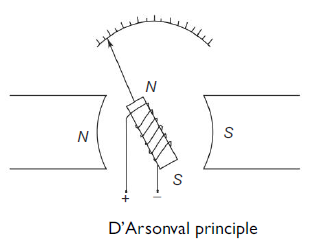

## Introduction

<b>Discipline | <b> Electrical Engineering 
:--|:--|
<b> Lab | <b> **Control and Instrumentation Lab**
<b> Experiment|     <b> **Transient and frequency response of D’ Arsonval galvanometer and Experiment 11**

### About the Experiment 
**System description**

The action of the most commonly dc meter is based on the fundamental principle of the motor. The motor action is produced by the flow of a small current through a moving coil, which is positioned in the field of a permanent magnet. This basic moving coil system is often called the D’Arsonval galvanometer. The D’Arsonval movement shown in Fig. below employs a spring-loaded coil through which the measured current flows. The coil (rotor) is in a nearly homogeneous field of a permanent magnet and moves in a rotary fashion. The amount of rotation is proportional to the amount of current flowing through the coil. A pointer attached to the coil indicates the position of the coil on a scale calibrated in terms of current or voltage.It responds to dc current only, and has an almost linear calibration. The magnetic shunt that varies the field strength is used for calibration.
			  

                  

<b>Name of Developer | <b> **Prof. Alok Kanti Deb**
:--|:--|
<b> Institute | <b>  **Indian Institute of Technology Kharagpur**
<b> Email id|     <b>  **alokkanti@ee.iitkgp.ac.in**
<b> Department |  **Department of Electrical Engineering**
<b>Webpage| <b> http://www.iitkgp.ac.in/department/EE/faculty/ee-alokkanti

### Contributors List

SrNo | Name | VLabs Developer or Integration Engineer | Designation | Department| Institute
:--|:--|:--|:--|:--|:--|
1 | **Piyali Chattopadhyay** | Developer & Integration | Project Scientist | Department of Electrical Engineering | IIT Kharagpur | 
