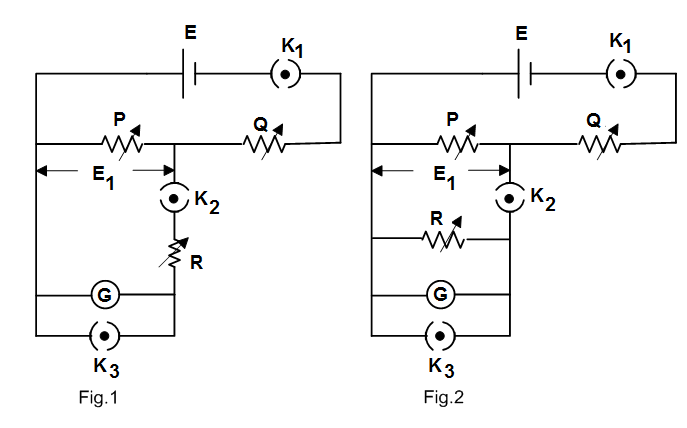
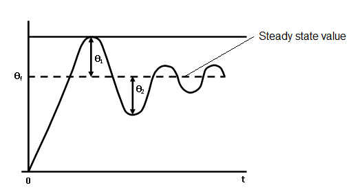

### Procedure

							

[Fig 2: Experimental set-up for Magnetic Levitation Control simulation]

								
								
**Steps to perform the simulation**

The experiment is having two different types of circuit connections

				

								            

								
**Steps to perform the simulation**

Finding galvanometer constants
					
1. At first connect the circuit diagram properly through the connecting dots (black dots) according to below instruction. First the galvanometer would be connected in series with the resistance box R (i.e series circuit).

9-7, 7-17, 18-13, 14-22, 23-16, 19-20, 21-12, 15-17, 8-11, 6-16
  
2. Click on 'Check Connection' button to check whether the connection is proper or not. Click on the key of 'k3' to open it. Then click on the mcb and switch on the light by clicking on the red switch.The 
reflection from galvanometer (yellow spot) will be seen on the scale.
					  
3. P, Q, R are the resistance boxes. Keeping R to zero value adjust the values of P (0.2 &ohm;) and Q (1670&ohm;) by respective rotating knobs to achieve 20cm deflection on scale.

(**Note:** click on plus sign to increase and on minus sign to decrease the value. The number,written on the knobs shows the multiplying factors of respective knobs.)
						
4. Now open the switch k2 by removing the conncetion 13-18 through clicking on it. After clicking on the conection 13-18, one alert message will come. Keep ready stop watch in mobile. Click on the confirmation alert message and start the stop watch together. Observe the oscillation of the light spot on the scale. Count number of oscillations and stop the watch when the oscillation stops.

5. Enter the number of oscillations observed and time of the stop watch in the right hand side box under scale. Click on 'Show Table' button and then on 'Time period'. The observation table will be shown at the bottom of the page. Switch off the light ,click on the key of 'k3' to open it and again connect 13-18. Switch on the light. Disconnect the connection 13-18 for another two times and take observation for time period. After taking three successive observations , calculate the average time period of the galvanometer. Write it in the input box under the table and take a note of it.
					  
6. After calculation of average time period , connect 13-18 again and click on the key of 'k3' to open it. Switch on the light. Deflection should be 20cm now on scale. To determine coil resistance Rc (in &ohm;) of the galvanometer, slowly increase the value of R(70 &ohm;)to get 10cm deflection on scale. This value or R is called Rc. Switch off the light and connect 13-18. Bring all the resistance values to zero.
					 
7.  Now the galvanometer would be connected in parallel the resistance box R (i.e. parallel circuit). To make the parallel connection, delete connection 14-22 and connect 14-16, 17-22. Click on 'Check Connection' button to check whether the connection is proper or not. Click on the key of 'k3' to open it and switch on the light. To determine external resistance Rs for critical damping of the galvanometer adjust the values of P (0.2 &ohm;) and Q (1670&ohm;) by respective rotating knobs to achieve 20cm deflection on scale. Now adjust R so as to obtain oscillatory motion, then decrease R(96 &ohm;) until the motion just ceases to be oscillatory. This value of R is Rs. Note down it. Switch off the light. 
					 
8. Now make the series connection again, as said in step 1. To determine sensitivity S (in rad/ampere) of the galvanometer, keep the value of R ( Rs &plus; Rc) a  convenient value say 100 &ohm;. Set P to 0.1 &ohm; , open k3 and switch on the light. Click on 'Show Table' button and then on 'Sensitivity'. The observation table will be shown at the bottom of the page. Increase the value of P to 0.2, 0.3, 0.4 and 0.5. Each time after increasing the value click on 'Show Table' button and then on 'Sensitivity' to take the observation. 
					 
9. At the end of 5 observations click on 'Plot' then on 'Ig Vs. &theta; '. The plot will be shown with Ig in (uA) and &theta; in radian. From the slope of the plot find the value of sensitivity 'S' in rad/A. The formula is as follows:

$$Sensitivity (\ rad/A) = \frac{\ difference \ in \ deflection ( \ say \Delta\theta)}{ \ difference \ in \ galvanometer \ current \ \Delta I_g \times 10^{-6} }$$

10. Enter the values of average time period, coil resistance Rc, external resistance Rs and sensitivity S in the left hand side input box under the scale. Click on 'Calculate' button. The results will be shown in respective input boxes in right hand side box. Note down the values of galvanometer displacement constant(G),restoring constant(k), Moment of inertia(J). Click on 'Clear' button. Switch off the light.

Transient Response
					
1. At first connect the circuit diagram as said in step 1 of 'Finding galvanometer constants' section. Click on 'Experiments' button, then 'Transient Response' under it.
  
2. Click on the key of 'k3' to open it. Then switch on the light by clicking on the red switch.The 
reflection from galvanometer (yellow spot) will be seen on the scale.
					  
3. Adjust the values of P (0.2 &ohm;) and Q (1670&ohm;) by respective rotating knobs to achieve 20cm deflection on scale.
					 
4. Now open the switch k2 by removing the connection 13-18 through clicking on it. The under damped response for sudden disconnecting switch k2 will be shown at the bottom of the page.
 Calculate &theta;1 and &theta;2 from the response using the formula below.

$$\theta_1 = (\ First \ overshoot - \ Steady \ state \ value) \ and \ \theta_2 = (\ Steady \ state \ value - \ First \ undershoot)$$

					 
5. Now put those values in the right hand side box under scale. Click on 'Calculate' button to calculate the value of open circuit damping ratio(&delta;0).
					 
6. Switch off the light, connect 13-18 again and switch on the light. Set R to 200 &ohm;. The under damped response for this value of R will be shown at the bottom of the page.The response is having small intervals along Y-axis so that the peak value or &theta;peak can be measured properly.
					 
7. Enter the values of &theta;peak, &theta;steady-state (steady-state value of the response) in the left hand side input box under the scale.Click on 'Calculate' button to calculate the &prcent;overshoot. 
					 
8. Click on 'Show Table' button and then on '&prcent;Overshoot'. The observation table will be shown at the bottom of the page. Increase the value of R to 300, 400, 500. Each time after increasing the value click on 'Show Table' button and then on '&prcent;Overshoot' to take the observation. 
					 
9. At the end of 5 observations click on 'Plot' then on '&prcent;Overshoot Vs. &delta; '. The plot will be shown. Click on 'Clear' button.Switch off the light.

Frequency Response
					
1. At first connect the circuit diagram as instructed below.

1-7, 7-17, 18-13, 14-22, 23-16, 19-20, 21-12, 15-17, 2-11, 6-16

Click on 'Check Connection' button to check whether the connection is proper or not. Click on 'Experiments' button, then 'Frequency Response' under it.
  
2. Click on the key of 'k3' to open it. Enter the value of average time period of the galvanometer, calculated in section 1 (Finding galvanometer constants) in the input box , at the bottom of the page. Click on 'Calculate' button to calculate the natural frequency of galvanometer (&omega;n).
					  
3. Switch on the light.The light spot will be oscillating since the supply is 2v ac now. Frequency is now 0.1Hz.
					 
4. Click on 'Show Table' button and then on 'Oscillation Amplitude'. The observation table will be shown at the bottom of the page. 
					 
5. Now increase the frequency of input signal through the frequency knob of function generator to 0.2 Hz, click on 'Sine' button and repeat step 4. Now increase frequency by step of 0.1 Hz up to 10 Hz. Each time after increasing the value click on 'Sine' button and repeat step 4.
					 
6. After taking observations click on 'Plot' button then on 'Amplitude Vs. Frequency'.The frequency response plot will be shown for a particular damping ratio(&delta;).
					 
7.  Click on 'Clear' button. Switch off the light. Change the value of &delta;(say 0.6,0.5,0.4) by changing the value of R (say 300, 400, 500 &ohm;), open k3 and follow steps 4-6 again to observe the frequency response for a different damping ratio(&delta;).
							
  