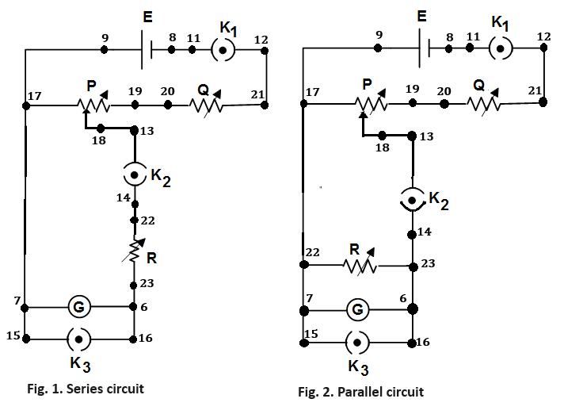
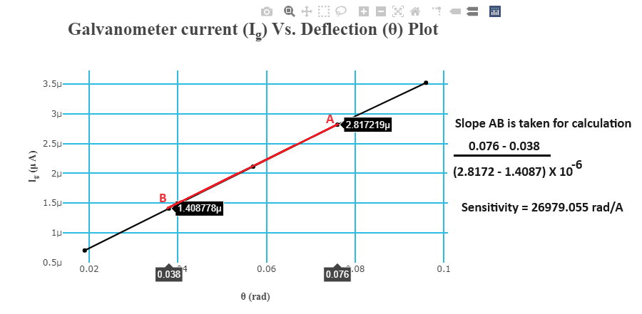
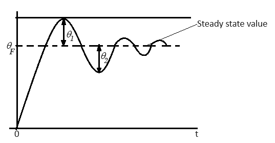
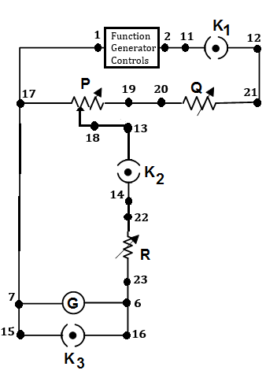

### Procedure
The experiment is having two different types of circuit connections 

								            

**Steps to perform the simulation**

<ol>
<b>Finding galvanometer constants</b>

<li><ul><li>First connect the circuit diagram properly through the connecting dots (black dots) according to below instruction in simulation page.</li>
<li><b>Note:</b> Example: connection point 1 - connection point 2 (drag the wire from connection point 1 by pressing left mouse button and release on connection point 2).</li>
<li>First the galvanometer would be connected in series with the resistance box R (Fig. 1.).</li>
<li>9-17, 17-7, 7-15, 8-11,12-21, 19-20, 18-13, 14-22, 23-6, 6-16</li>
<li><b>Note:</b> Any wire connection can be deleted by clicking on the connected wire if required.</li>
</ul></li> 

<li><ul><li>Click on 'Check Connection' button to check whether the connection is proper or not.</li>
<li>Click on the key of 'K3' to open it.</li>
<li>Then click on the mcb and switch on the light by clicking on the red switch.</li>
<li>The reflection from galvanometer (yellow spot) will be seen on the scale.</li></ul></li> 

<li>P, Q, R are the resistance boxes.
<ul>
<li>Keeping R to zero value adjust the values of P (0.2 &ohm;) and Q (1670&ohm;) by respective rotating knobs to achieve 20 cm deflection on scale.</li>
<li><b>Note:</b> To rotate any knob put the mouse cursor on the knob handle (blue line on the knob), a hand symbol will be showing. Press left mouse button, rotate clockwise to increase or anticlockwise to decrease values.</li>
<li><b>Note:</b> If the desired value does not appear while rotating the knob in one attempt, try rotating it back and forth to reach the correct value. If the knob becomes unresponsive at any time, please refresh the page and repeat the experiment.</li>
<li>(<b>Note:</b> The numbers, written near the knobs (in &ohm; or k&ohm;), shows the multiplying factors of respective knobs.)</li>						
<li> Now open the switch K2 by removing the connection 13-18 through clicking on it.</li>
<li>After clicking on the connection 13-18, one alert message will come. Keep ready the stop watch in mobile.</li>
<li>Click on the confirmation alert message and start the stop watch together.</li>
<li>Observe the oscillation of the light spot on the scale. Count number of oscillations and stop the watch when the oscillation stops.</li></ul></li> 

<li><ul><li>Enter the number of oscillations observed and time of the stop watch in the right hand side box under the scale.</li>
<li>Click on 'Show Table' button , then on 'Time period'.</li>
<li>The observation table will be shown at the bottom of the page. Switch off the light.</li>
<li>Click on the switch 'K3' to open it and again connect 13-18.</li>
<li>Switch on the light.</li>
<li>Disconnect the connection 13-18 for another two times and take observation of time period following step 3.</li>
<li>After taking three successive observations, calculate the average time period (T) of the galvanometer and note it. It will be required in 'Frequency Response' section.</li>
<li>Write it in the input box under the table as well as in the corresponding box under the scale. Switch off the light.</li></ul></li> 

<li> <ul><li>After calculation of average time period, connect 13-18 again and click on the switch 'K3' to open it.</li>
<li>Switch on the light. Deflection should be 20 cm now on scale.</li>
<li>To determine coil resistance Rc (&ohm;) of the galvanometer,
slowly increase the value of R (70 &ohm;) to get 10 cm deflection on scale.</li>
<li>This value or R is called Rc. Write it in the corresponding box under the scale. Switch off the light.</li>
<li>Bring R resistance value to zero.</li></ul></li> 

<li><ul><li>Now the galvanometer would be connected in parallel with the resistance box R (Fig. 2.).</li> 
<li>To make the parallel connection, delete connection 14-22, 7-17 by clicking on the wires and connect 14-23, 7-22, 22-17.</li> 
<li>Click on 'Check Connection' button to check whether the connection is proper or not.</li>
<li>Click on the switch 'K3' to open it and switch on the light.</li>
<li>To determine external resistance Rs (&ohm;) for critical damping of the galvanometer,
adjust the values of P (0.2 &ohm;) and Q (1670 &ohm;) by respective rotating knobs to achieve 20 cm deflection on scale.</li>
<li>Now adjust R to obtain oscillatory motion (&approx; 100 &ohm;), 
then decrease R (&approx; 90 &ohm;) until the motion just ceases to be oscillatory.</li>
<li>This value of R is Rs.</li>
<li>Write it in the corresponding box under the scale. Switch off the light.</li></ul></li> 

<li><ul><li>Now make the series connection again, as said in step 1. Click on 'Check Connection' button to check whether the connection is proper or not.</li>
<li>To determine sensitivity S (rad/ampere) of the galvanometer, keep the value of R (Rs &plus; Rc) to a  convenient value
say 100 &ohm;.</li>
<li>Set P to 0.1 &ohm; , open K3 and switch on the light.</li>
<li>Click on 'Show Table' button and then on 'Sensitivity'. The observation table will be shown at the bottom of the page.</li>
<li>Increase the value of P to 0.2, 0.3, 0.4 and 0.5. Each time after increasing the value click on 'Show Table' button and then on 'Sensitivity' to take the observation.</li></ul></li> 

<li><ul><li>At the end of 5 observations click on 'Plot', then on 'Galvanometer current (Ig) Vs. Deflection (&theta;)'.</li>
<li>The plot 'Galvanometer current (Ig) Vs. Deflection (&theta;)' 
will be shown with Ig in (uA) and &theta; in radian (hover over the plot section and then click on the camera icon located at the top right corner of the plot to download it).</li>
<li>From the slope of the plot find the value of 
sensitivity S (rad/A) as shown in Fig. 3. The formula is as follows :</li> 

$$Sensitivity \ (rad/A) = \frac{difference \ in \ deflection \ (say \ \Delta\theta)}{ \ difference \ in \ galvanometer \ current \  \Delta I_g \times 10^{-6} }$$

<li> Write it in the corresponding box under the scale.</li></ul>
</li> 		 

 
<b>Fig. 3. Calculation of Sensitivity</b>

  

<li><ul><li>Click on 'Calculate' button at the bottom of the left hand side box under the scale.</li>
<li>The results will be shown in respective input boxes in the right hand side box under the scale.</li>
<li>Note down the values of galvanometer displacement constant (G),
restoring constant (K), moment of inertia (J).</li>
<li>Click on 'Clear' button.</li>
<li>Switch off the light. Bring all the resistances to zero value.</li>
<li>These constants are calculated using the equations below.</li></ul>

$$G = \frac{T(R_c + R_s)}{\pi S} \ nw-m/A/A$$
$$K = \frac{T(R_c + R_s)}{\pi S^2} \ nw-m/rad$$
$$J = \frac{T^3(R_c + R_s)}{4 \pi^3 S^2} \ kg-m^2$$

</li> 

  
</ol>

<ol>
<b>Transient Response</b>

<li><ul><li>First connect the circuit diagram as said in step 1 of 'Finding galvanometer constants' section.</li>
<li>Click on 'Experiments' button, then 'Transient Response' under it.</li></ul></li>

<li><ul><li>Click on the switch 'K3' to open it.</li>
<li>Then switch on the light by clicking on the red switch.</li>
<li>The reflection from galvanometer (yellow spot) will be seen on the scale.</li></ul></li> 

<li> Adjust the values of P (0.2 &ohm;) and Q (1670&ohm;) by respective rotating knobs to achieve 20 cm deflection on scale.</li> 

<li><ul><li>Now open the switch K2 by removing the connection 13-18 through clicking on it.</li>
<li>The under damped response for sudden disconnecting switch K2
will be shown at the bottom of the page (Fig. 4) (click on 'Download Plot' button to download this plot).</li>
<li>Calculate &theta;1 and &theta;2 from the response using the formula below.</li></ul> 

$$\theta_1 = (First \ overshoot - \ Steady \ state \ value) \ and \ \theta_2 = (Steady \ state \ value - \ First \ undershoot)$$

</li> 

 
<b>Fig. 4. Calculation of &theta;1 and &theta;2</b>

  

<li><ul><li>Now put those values in the right hand side box under the scale.</li>
<li>Click on 'Calculate' button in that box to calculate the value of open circuit damping ratio (&delta;0)</li></ul></li> 

<li><ul><li>Switch off the light, connect 13-18 again and open K3.</li>
<li>Switch on the light. Set R to 200 &ohm;. The underdamped response for this value of R will be shown at the bottom of the page (click on 'Download Plot' button to download this plot).</li>
<li>The response is having small intervals along Y-axis so that the peak value or &theta;peak can be measured properly.</li></ul></li> 

<li><ul><li>Enter the values of &theta;peak, &theta;steady-state (steady-state value of the response) in the left hand side input box under the scale.</li>
<li>Click on 'Calculate' button in that box to calculate the &percnt; overshoot.</li></ul> </li> 

<li><ul><li>Click on 'Show Table' button, then on '&percnt; Maximum overshoot'.</li>
<li>The observation table will be shown at the bottom of the page.</li>
<li>Increase the value of R to 300, 400, 500.</li>
<li>Each time after increasing the value of R follow step 7 and click on 'Show Table' button, then on '&percnt; Maximum overshoot' to take the observation.</li></ul> </li> 

<li><ul><li>After taking 5 observations click on 'Plot' button, then on '&percnt; Maximum overshoot Vs. Damping ratio &delta;'.</li>
<li>The plot will be shown (hover over the plot section, then click on the camera icon located at the top right corner of the plot to download it).</li>
<li>Click on 'Clear' button. Switch off the light.</li></ul></li> 
  
</ol>

<ol>
<b>Frequency Response</b>

<li><ul><li>Once the transient response of the galvanometer is acquired, it is possible to observe its frequency response.</li>
<li>First connect the circuit diagram as instructed below.</li>

 
<b>Fig. 5. Connection diagram for Frequency Response</b>

 
<li>1-17, 17-7, 7-15, 2-11, 12-21, 19-20, 18-13, 14-22, 23-6, 6-16</li>
<li>Click on 'Check Connection' button to check whether the connection is proper or not.</li>
<li>Click on 'Experiments' button, then on 'Frequency Response' under it.</li></ul></li> 

<li><ul><li>Click on the switch 'K3' to open it.</li> 
<li>Enter the value of average time period of the galvanometer, calculated in 'Finding galvanometer constants' section in the input box 
at the bottom of the page.</li>
<li>Click on 'Calculate' button to calculate the natural frequency of galvanometer (&omega;n).</li></ul></li> 

<li> Switch on the light. The light spot will be oscillating since the supply is 2 V ac now. Frequency is now 0.1 Hz.</li> 

<li> Click on 'Show Table' button, then on 'Oscillation Amplitude'. The observation table will be shown at the bottom of the page. </li> 

<li><ul><li>Now increase the frequency of input signal through the frequency knob of function generator to 0.2 Hz.</li>
<li>Click on 'Sine' button and repeat step 4.</li>
<li>Now increase frequency by step of 0.1 Hz upto 10 Hz.</li>
<li>Each time after increasing the value click on 'Sine' button and repeat step 4.</li></ul></li> 

<li><ul><li>After taking observations click on 'Plot' button, then on 'Amplitude (cm) Vs. Frequency (Hz)'.</li>
<li>The frequency response plot will be shown for a particular damping ratio (&delta; (e.g. 0.47 for R = 500 &ohm;)).</li></ul></li> 

<li><ul><li>Click on 'Clear' button. Switch off the light.</li>
<li>Change the value of &delta; (say 0.6, 0.96 &approx; 1) by changing the value of R (say 400, 200 &ohm;) and follow steps 4-6 again to 
observe the frequency response for different damping ratios (&delta;). Compared plot can be observed for five distinct values of &delta;.</li></ul></li> 

</ol>

<link href="./simulation/css/galvano.css" rel="stylesheet">

  
