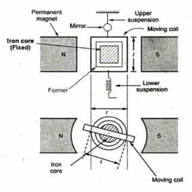
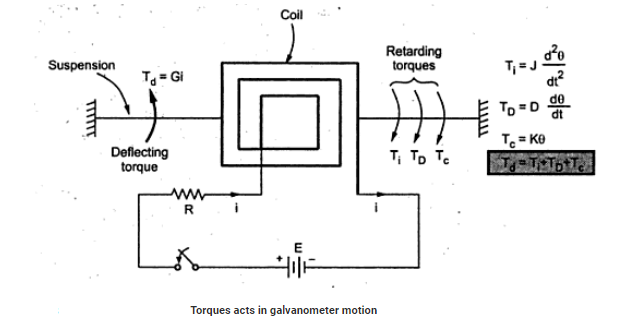

# Theory

 <b style="color:blue">Galvanometer:</b>

The use of D'Arsonval galvanometer is very common in variety of measuring instruments. The galvanometer is basically used in an instrument for detecting the presence of small voltages or currents in a circuit or to indicate zero current in applications like bridge circuits. Thus galvanometer has to be very much sensitive.
				 
<b color="blue">Construction</b>

The construction of  D'Arsonval galvanometer is shown in the Fig. below.
				 

                  

It consists of the following parts,
				
1. **Moving coil:**

The moving coil is rectangular or circular in cross-section, carrying number of turns of fine wire.
It carries the current proportional to the quantity to be measured. It is suspended in the air gap between the
poles of a permanent magnet and iron core. It is free to turn about its vertical axis. The pole faces are of
particular shape such that the magnetic field is radial.
				
2. **Iron core:**

It is spherical if coil is circular and cylindrical if coil is rectangular. It is basically used to provide low
reluctance path the the magnetic flux and to produce strong magnetic field. This ensures higher deflecting
torque and better sensitivity of the galvanometer. The air gap is about 1/16 inches i.e. about 1.5 mm. If small
moment of inertia is necessary, the iron core can be be omitted but it decreases the sensitivity.
				
3. **Suspension:**

The suspension is a single file strip of phosphor-bronze and serves as one lead of the coil. The other lead takes the form of a loosely coiled spiral of fine wire leading downwards from the bottom of the coil.
This is lower suspension. This type of galvanometer requires a perfect leveling so that the suspension coils
remain straight and in central position without rubbing the poles or iron core. in galvanometers which do not
require the perfect leveling, taut suspensions with straight flat strips are used, which are kept under tension
from both sides.
				
4. **Damping:**

The damping is eddy current damping. The eddy currents developed in the metal former on which coil is mounted, are responsible to produce damping torque. For effective damping a low resistance is connected across the galvanometer terminals. By adjusting the value of this resistance damping can be changed and critical damping can be achieved.
				
5. **Indication:**

The suspension carries a small mirror upon which a beam of light is cast through a glass window in the outer brass case surrounding the instrument.The beam of light is reflected on the scale. The scale is usually 1m away from the mirror.
				
6. **Zero adjustment:**

A torsion head is provided for the adjustment of the coil position and zero setting.
				
<b color="blue">Torque Equation</b>
				 
The various parameters involved in torque are,
				
l  = Length of coil measured along vertical axis in m.

r = width of coil in m,

N = Number of turns of coil.

B = Flux density in air gap in Wb/m2 or Tesla.

i = Current through coil in A.

k = Spring constant or restoring constant in Nm/rad.

&alpha;  = Angle between plane of coil and direction of magnetic field.

A = Area of coil in m2 =  l x r.

&theta;f  = final steady state deflection of coil in rad.

F = Force on each side of a coil = NB ilsin N                 .....(1)

Td  = Deflecting torque = F x d = NBil sinr                       ......(2)

Td = NBiA sin &alpha;

As the field is radial in nature, = 90&deg; hence sin&alpha; = 1.

Td  = NB i A = Gi = G i Nm                               .......... (3)

where G = NBA = Galvanometer constant

The restoring torque provided by the spring is directly proportional to the final deflection of the coil.

Tc   = k &theta;f 

For final steady state position of coil,

Td   = Tc  

Gi = k &theta;f  

D = Damping coefficient

J = Moment of Inertia in kg-m2

The scale is calibrated in mm. The scale is at a distance of 1 m from the mirror as shown in the Fig. below.
				

                  

		
				
For small deflection, the radius of arc and angle of turning, decide the deflection.The angle through which the beam gets reflected is 2&theta;f if mirror is turned through &theta;f.

$$d (mm) = \theta_f \times r$$
		
$$\theta = \frac{2Gir}{k} mm$$
		
Note: Usually r = 1 m = 1000 mm for the galvanometer.		
				
<b color="blue">Dynamic Behaviour of Galvanometer</b>

The dynamic behaviour of galvanometer is analysed through its equation of motion.The second order differential equation governing the galvanometer motion,

                   

	   
				
$$J \frac{d^2 \theta}{dt^2} + D \frac{d\theta}{dt} + k\theta = Gi$$
		
The solution of this equation has two parts, 1) Complementary function, 2) Particular integral.The complementary function (C.F.) represents the transient behaviour while particular integral (P.I.) represents the steady state condition i.e. final deflection of the moving system.The behaviour of system before it achieves the steady state is transient behaviour. When transient behaviour dies out, the system achieves final steady state position.The auxiliary equation of above differential equation is obtained as,
	   
$$Jm^2+Dm+k = 0$$

The roots of the equation are,
			
$$m_1 = \frac{-D+\sqrt{D^2 - 4Jk}}{2J} , m_2 = \frac{-D-\sqrt{D^2 - 4Jk}}{2J}$$
				
Hence the solution has two exponential terms of power m1  and m2 	
				
$$\theta = A e^{m_1 t} + B e^{m_2 t}$$
				
Now when steady state is reached,
			
$$\frac{d \theta}{dt}=0 , \frac{d^2 \theta}{dt^2}=0$$
				
Then finally we get  Gi = k &theta;f  
				
Now the transient terms may be purely exponential or oscillatory which depends on the nature of roots m1  and m2. This defines the various damping conditions of the system.	
				
<b>Underdamped Motion ( &zeta; < 0 ) </b>
			
Both m1  and m2 are complex conjugates of each other having negative real part.
			
$$m_1,m_2 = -\frac{D}{2J} \pm j\frac{\sqrt{4Jk - D^2}}{2J} = -\alpha \pm j\omega_d$$

$$D^2 - 4Jk \lt 0 $$
			
In this case solution will be,
			
$$\theta = \theta_f [ 1 - \frac{2\sqrt{Jk}}{4Jk - D^2}  e^{\frac{-D}{2J}t}  sin( \omega_d t + \alpha ) ]$$
			
where,
			
$$\omega_d = \frac{\sqrt{4Jk - D^2}}{2J} , \alpha = \frac{D}{2J}$$
			
<b>Critically damped Motion ( &zeta; = 1 ) </b>
			
For critically damping, the roots m1 and m2 are equal, real and negative.
			
$$m_1 = m_2 = \frac{-D}{2J}$$
			
$$D^2 - 4Jk = 0 , D = 2\sqrt{Jk}$$
			
In this case solution is,
			
$$\theta = \theta_f [ 1 - e^{-\frac{D}{2J}}t ( 1 + \frac{D}{2J}t )]$$
			
<b>Over damped Motion ( &zeta; > 1 ) </b>
			
When the damping is more than the damping for critical case, the motion is called over damped and the roots m1 and m2 are real, unequal and negative.
			
In this case solution is,
			
$$\theta = \theta_f [ 1 + \frac{\zeta + \sqrt{\zeta^2 -1}}{2 \sqrt{\zeta^2 -1}}e^{-\omega_n t}(\zeta - \sqrt{\zeta^2 -1}) - \frac{\zeta - \sqrt{\zeta^2 -1}}{2 \sqrt{\zeta^2 -1}}e^{-\omega_n t}(\zeta + \sqrt{\zeta^2 -1}) ]$$
			
where natural frequency = &omega;n

$$\omega_n = \sqrt{\frac{k}{J}}$$
			
<b color="blue">Finding Galvanometer Constants </b>

In this part we need to calculate 

Galvanomer displacement constant G,

Restoring constant k,

Moment of inertia of the system J.
				
$$G = \frac{T(R_c + R_s)}{\pi S} mw-m/A/A$$

$$k = \frac{T(R_c + R_s)}{\pi S^2} nw-m/rad$$

$$J = \frac{T^3(R_c + R_s)}{4 \pi^3 S^2} kg-m^2$$
				
where, T = Free period of the galvanometer on open circuit in seconds.

Rc = Coil resistance(&ohm;) 

Rs = External resistance for critical damping (&ohm;)

S = Current sensitivity of galvanometer in rad/A from the slope of Ig Vs. theta plot.
				
				
						
								